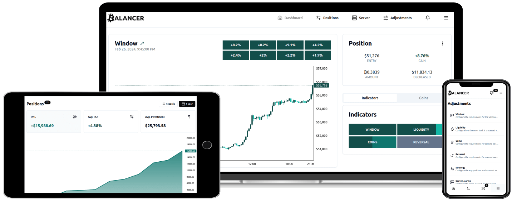

# Balancer

Balancer is an open-source, self-hosted platform that automates the [Value Averaging Strategy](https://www.investopedia.com/terms/v/value_averaging.asp) for the Bitcoin spot market. It is exchange-agnostic and highly configurable.

- [Live demo](https://balancer.jesusgraterol.dev/)
- [Run your own Balancer Instance](https://github.com/bitcoin-balancer/cli)
- [Contact author](mailto:jesusgraterol.dev@protonmail.com)

 

## Repositories

- [Command Line Interface (cli)](https://github.com/bitcoin-balancer/cli)
- [Application Programming Interface (api)](https://github.com/bitcoin-balancer/api)
- [Graphical User Interface (gui)](https://github.com/bitcoin-balancer/gui)
- [Cloudflare Tunnel (ct)](https://github.com/bitcoin-balancer/ct)

 

## Docker Images

- [postgres](https://hub.docker.com/_/postgres)
- [jesusgraterol/balancer-api](https://hub.docker.com/r/jesusgraterol/balancer-api)
- [jesusgraterol/balancer-gui](https://hub.docker.com/r/jesusgraterol/balancer-gui)
- [jesusgraterol/balancer-ct](https://hub.docker.com/r/jesusgraterol/balancer-ct)

 

## Sections

- [Supported Exchanges](profile/sections/supported-exchanges/index.md)
- [Screenshots](profile/sections/screenshots/index.md)
- [@TODOS](profile/sections/todos/index.md)
- [Terms of use](profile/sections/terms-of-use/index.md)

 

## License

[Apache v2.0](https://www.apache.org/licenses/LICENSE-2.0)