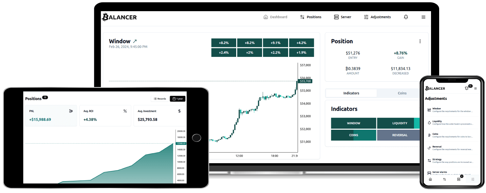

# Balancer

Balancer is a cutting-edge, open-source, self-hosted platform that empowers users to trade Bitcoin automatically. It is exchange-agnostic and highly configurable.

- [How does it work?](#how-does-it-work)
- [Run your own Balancer Instance](#run-your-own-balancer-instance)
- [Live demo](https://balancer.jesusgraterol.dev/)
- [Contact author](mailto:jesusgraterol.dev@protonmail.com)

 

## How does it work?

Balancer helps you automate your Bitcoin trades by responding to market conditions.

When the price drops significantly, it analyzes multiple indicators to assess the chances of a rebound. If a reversal seems likely, it increases your position using a portion of your budget, aiming to improve your weighted entry price.

When the price rises and your position turns profitable, Balancer gradually sells portions of your Bitcoin to secure gains. The greater the profit, the larger and more frequent the reductions.

### Indicators

- [Window](sections/indicators/window/index.md)
- [Liquidity](sections/indicators/liquidity/index.md)
- [Coins](sections/indicators/coins/index.md)
- [Reversal](sections/indicators/reversal/index.md)

### Position management

- [Strategy](sections/position-management/strategy/index.md)
- [Templates](sections/position-management/templates/index.md)

 

## Run your own Balancer Instance

For most users, [`cli-lite`](https://github.com/bitcoin-balancer/cli-lite) provides everything needed to run a Balancer instance effortlessly. For advanced control and customization, use [`cli`](https://github.com/bitcoin-balancer/cli) instead.

 

## Repositories

- [Command Line Interface (`cli`)](https://github.com/bitcoin-balancer/cli)
- [Command Line Interface Lite (`cli-lite`)](https://github.com/bitcoin-balancer/cli-lite)
- [Application Programming Interface (`api`)](https://github.com/bitcoin-balancer/api)
- [Graphical User Interface (`gui`)](https://github.com/bitcoin-balancer/gui)
- [Cloudflare Tunnel (`ct`)](https://github.com/bitcoin-balancer/ct)

 

## Docker Images

- [postgres](https://hub.docker.com/_/postgres)
- [jesusgraterol/balancer-api](https://hub.docker.com/r/jesusgraterol/balancer-api)
- [jesusgraterol/balancer-gui](https://hub.docker.com/r/jesusgraterol/balancer-gui)
- [jesusgraterol/balancer-ct](https://hub.docker.com/r/jesusgraterol/balancer-ct)

 

## Sections

- [Supported exchanges](./sections/supported-exchanges/index.md)
- [Screenshots](./sections/screenshots/index.md)
- [@TODOS](./sections/todos/index.md)
- [Terms of use](./sections/terms-of-use/index.md)

 

## License

[Apache v2.0](https://www.apache.org/licenses/LICENSE-2.0)
