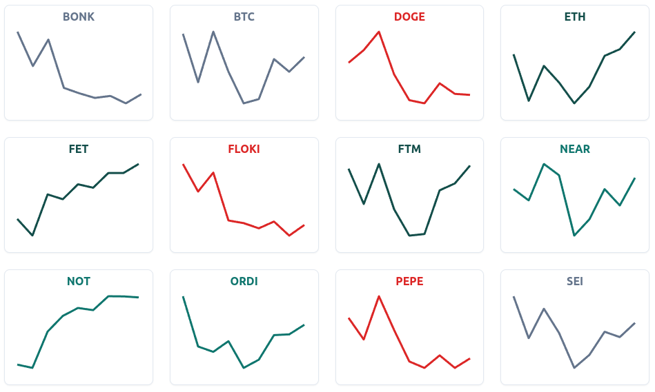

[< Back](../../../README.md#indicators)

# Coins

The Coins Indicator tracks the price movements of a selection of cryptocurrencies, chosen based on market capitalization and trading volume. It connects to a pre-configured exchange in real-time and analyzes price data for both **COIN/BTC** and **COIN/USD** pairs within a dynamic moving window.

Similar to the Window Indicator, the Coins Indicator calculates a "state" for each coin, but it focuses on a shorter time frame, using approximately 40 minutes of historical data compared to the Window Indicator's 32-hour window. This allows Balancer to monitor the flow of capital across the entire cryptocurrency market.

The **Reversal Indicator** leverages these calculated states to assess the overall market direction and identify potential price reversals.

