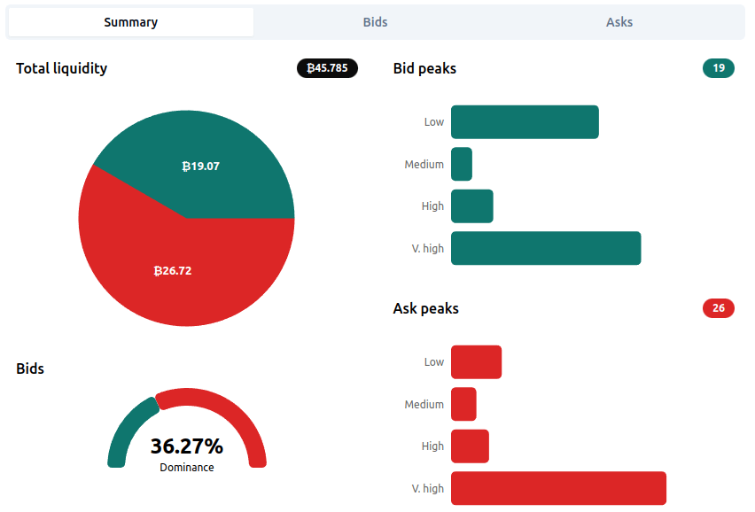

[< Back](../../../README.md)

# Liquidity

The Liquidity Indicator monitors the Bitcoin/Dollar order book on a pre-configured exchange in real-time. By analyzing and normalizing order book data, it detects unusual spikes in buying or selling liquidity.

Once these peaks are identified on both the bid and ask sides, the **"Bids' dominance"** is calculated. This metric reflects the relative strength of buyers versus sellers.

The **Reversal Indicator** then uses this dominance score to assess the current market direction and potential for a price reversal.

