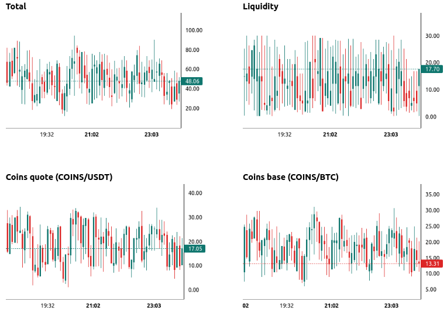
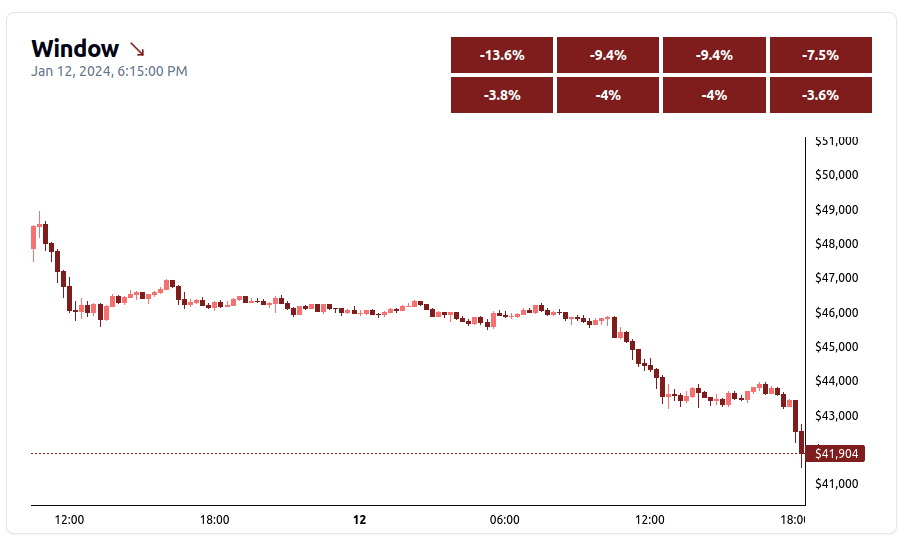

[< Back](../../../README.md#indicators)

# Reversal

The Reversal Indicator activates during significant price drops within the Window Indicator's observation period. During this time, It collaborates with other indicators to assess the likelihood of a price reversal.

## Calculation

Each indicator contributes a weighted score based on its relevance to potential price reversals. A minimum number of points must be accumulated across all indicators to trigger a reversal event.

The score is calculated every time the Window Indicator fetches new data (every ~3 seconds by default).

 

## Price crash state

The Reversal Indicator's activation during price crashes aligns with Balancer's "value averaging" trading strategy, which aims to increase portfolio size during price dips and reduce it during rallies. This strategic approach leverages the potential for price reversals following significant market downturns.

