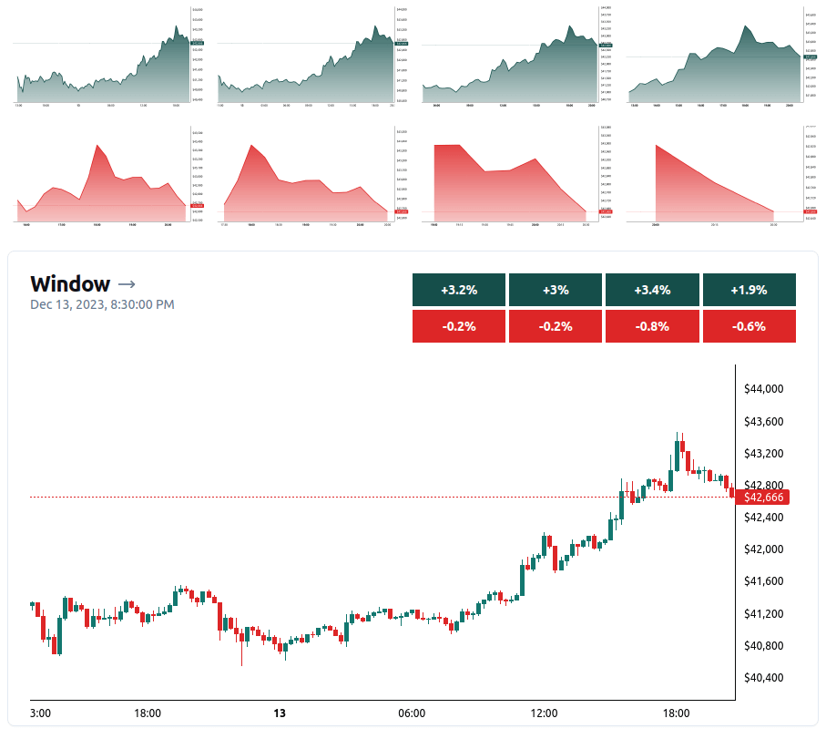
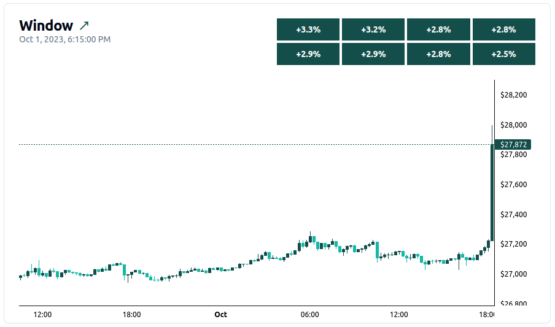

[< Back](../../../README.md)

# Window

The Window Indicator establishes a real-time connection with the pre-configured exchange and employs a dynamic moving window that analyzes Bitcoin's price to understand its current state and trend. This information allows Balancer to react to events accordingly.

## Calculation

The state of the window is calculated by applying eight distinct splits to the price dataset. Each split represents a different time frame, providing insights into long-term and short-term trends (giving more importance to the short-term).

By default, the window utilizes 128 15-minute candlesticks, spanning approximately 32 hours. These splits are applied as follows:

- **`100%`** last ~32 hours (128 items)
- **`75%`** last ~24 hours (96 items)
- **`50%`** last ~16 hours (64 items)
- **`25%`** last ~8 hours (32 items)
- **`15%`** last ~5 hours (20 items)
- **`10%`** last ~3.25 hours (13 items)
- **`5%`** last ~1.75 hours (7 items)
- **`2%`** last ~45 minutes (3 items)

The state of a split is derived by calculating the percentage change experienced from the beginning to the end of the dataset. The result is categorized into five distinct levels, indicating the strength and direction of the trend:

- **Increasing strongly (2)** - a clear upward trend with strong momentum
- **Increasing (1)** - a positive trend, but with less intensity than "Increasing strongly"
- **Sideways (0)** - a period of consolidation with no clear direction
- **Decreasing (-1)** - a negative trend with moderate downward momentum
- **Decreasing strongly (-2)** - a strong downward trend with significant downward momentum

Once the state for each split is calculated, the overall Window state is determined as follows:

```typescript
const calculateStateMean = (states: IState[]): IState => {
  const mean = calculateMean(states);
  if (mean >= 1.5) {
    return 2;
  }
  if (mean >= 0.75) {
    return 1;
  }
  if (mean <= -1.5) {
    return -2;
  }
  if (mean <= -0.75) {
    return -1;
  }
  return 0;
};
```

### Calculation example

The following example provides a visual representation of how the window state is calculated for a random period:



<br/>

## Uses

The indicator plays a crucial role in triggering other modules based on the Window's state.

### Decreasing strongly (-2)

When the window identifies the price of Bitcoin has crashed, it activates the **Reversal Indicator**. This module analyzes various indicators to determine potential opportunities for opening or increasing the position, seeking to capitalize on the reversal of the downward trend.


### Increasing strongly (2)

Conversely, when a strong upward trend is detected, the Strategy is triggered. This module assesses the current profit and loss (PNL) situation to determine if the position can be decreased, aiming to secure profits.


