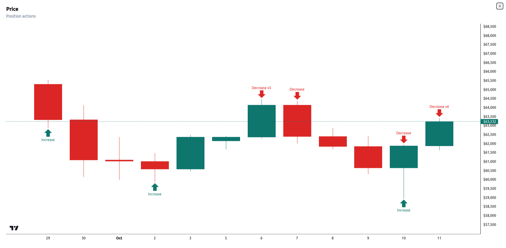
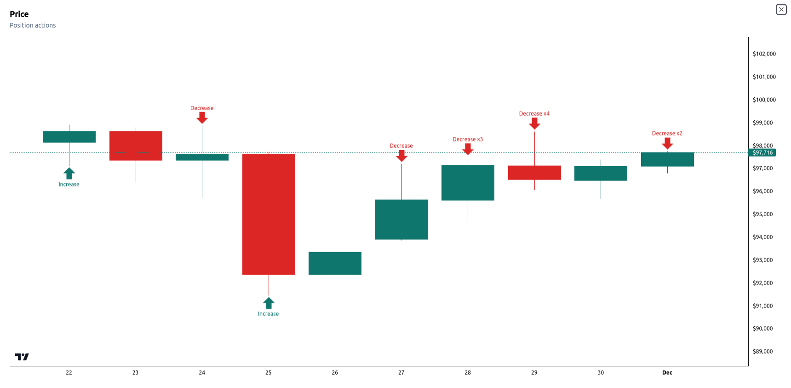
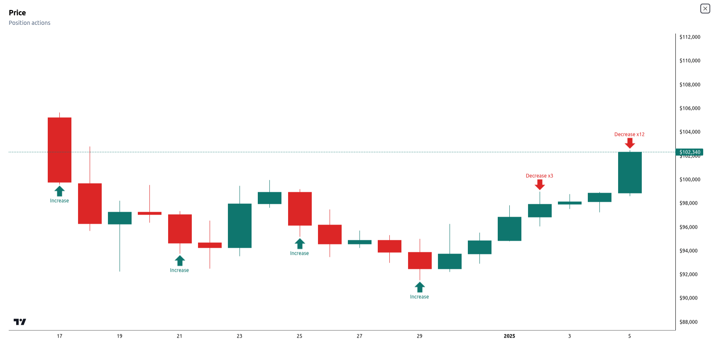
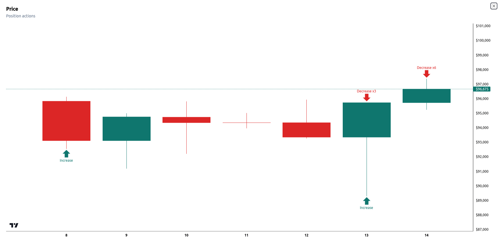
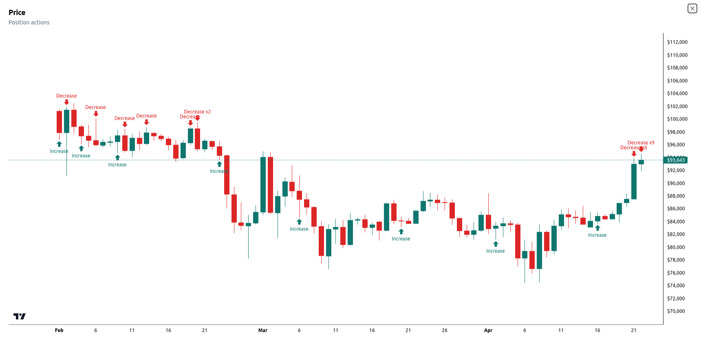
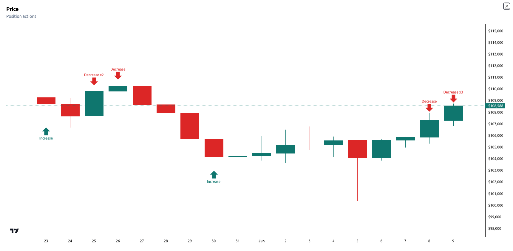

[< Back](../../../README.md#position-management)

# Examples

The following examples show how Balancer manages positions to demonstrate the strategy in action.

## Example #1

This position was active for approximately **12 days**, from Sep 29, 2024, to Oct 12, 2024, and delivered a return of **+2.52%**.

## Example #2

This position was active for approximately **9 days**, from Nov 22, 2024, to Dec 1, 2024, and delivered a return of **+1.4%**.

## Example #3

This position was active for approximately **20 days**, from Dec 17, 2024, to Jan 6, 2025, and delivered a return of **+2.68%**.

## Example #4

This position was active for approximately **6 days**, from Jan 8, 2025, to Jan 14, 2025, and delivered a return of **+2.79%**.

## Example #5

This position was active for approximately **3 months**, from Feb 1, 2025, to Apr 23, 2025, and delivered a return of **+3.52%**.

## Example #6

This position was active for approximately **17 days**, from May 23, 2025, to Jun 9, 2025, and delivered a return of **+1.57%**.

