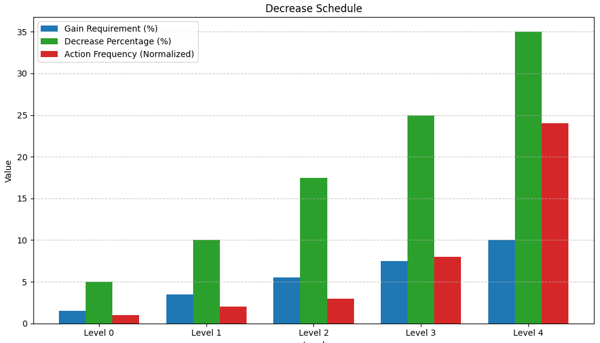

[< Back](../../../README.md#position-management)

# Strategy templates

Since launching Balancer, we’ve experimented with a wide range of strategies and gained valuable insights along the way. This page summarizes what we've learned and presents a collection of strategy templates designed to suit a variety of users and budgets.

For a detailed explanation of each strategy parameter, please refer to the [Strategy](../strategy/index.md) page.

 

## Budget management

When trading with Balancer, there are two primary budget types to consider:

### Fixed budget (Static sum of funds)

This applies when trading with a fixed total amount (e.g., $10,000). In this case, it's recommended to divide the total by 10 and use that portion to open or increase positions.

This approach helps maintain a reserve, allowing the strategy to react to further price drops by increasing the position and improving the average entry price.

**Example:** for a $10,000 budget, set the position `amount` to $1,000.

### Dynamic budget (Regular income stream)

This applies when funds are added regularly (e.g., from a salary or recurring investment plan). For this budget type, set the `amount` used per trade to what can be allocated roughly every two weeks.

**Example:** if $1,000 can be allocated monthly, set the position `amount` to $500.

 

## Templates

These strategy templates have been tested by our team and are suitable for a wide range of users. They serve as a foundation that can be fully customized as you gain experience with Balancer.

  
<strong>Eager Scalper (Default)</strong>

  ### Increase
  - **Amount:** refer to ["Budget management"](#budget-management)
  - **Gain requirement%:** `-3`
    - **Tip:** for dynamic budgets, consider setting this to `0` so positions can be increased even when they’re not at a loss.
  - **Idle duration:** `48`
  - **Idle mode:** `Incremental`

  ### Decrease
  - **Level 0**
    - **Gain requirement%:** `1.5`
    - **Percentage:** `5`
    - **Frequency:** `240`
  - **Level 1**
    - **Gain requirement%:** `3.5`
    - **Percentage:** `10`
    - **Frequency:** `120`
  - **Level 2**
    - **Gain requirement%:** `5.5`
    - **Percentage:** `17.5`
    - **Frequency:** `80`
  - **Level 3**
    - **Gain requirement%:** `7.5`
    - **Percentage:** `25`
    - **Frequency:** `30`
  - **Level 4**
    - **Gain requirement%:** `10`
    - **Percentage:** `35`
    - **Frequency:** `10`

  
   

