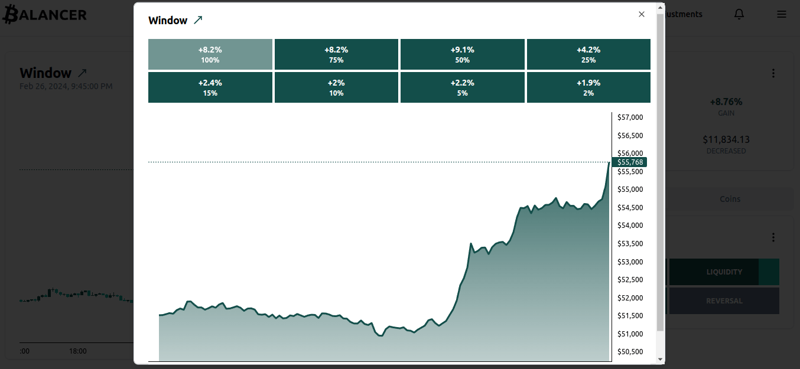
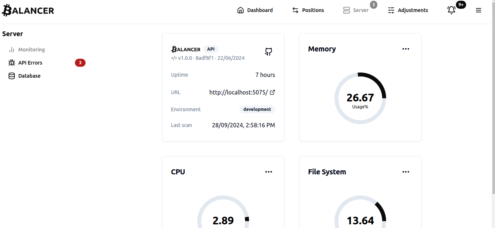
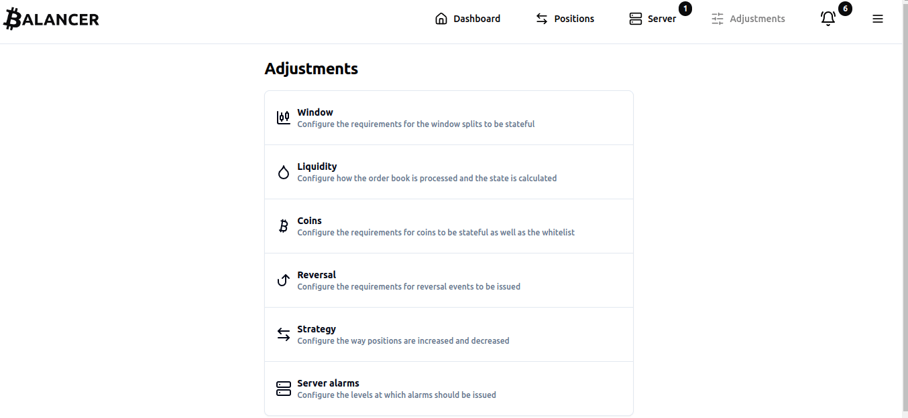
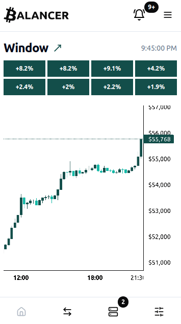
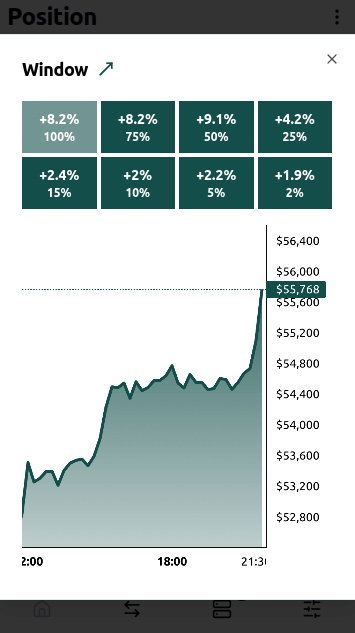

[< Back](../../README.md#sections)

# Screenshots

## Desktop

### Dashboard

This page provides a view of the price window, active position, indicators, and more.

 

### Window

This page displays the state of the price window segmented by splits, providing a detailed view of the current trend.

 

### Positions

This page displays Balancer’s performance over a custom date range, including PnL, average ROI, and average investment.

 

### Server

This page provides insights into server status, API errors, and database health.

 

### Adjustments

This page allows users to fine-tune indicators, adjust the trading strategy, and configure resource usage alarms.

 

## Mobile

### Dashboard

This page provides a view of the price window, active position, indicators, and more.

 

 

### Window

This page displays the state of the price window segmented by splits, providing a detailed view of the current trend.

 

### Positions

This page displays Balancer’s performance over a custom date range, including PnL, average ROI, and average investment.

 

### Server

This page provides insights into server status, API errors, and database health.

 

### Adjustments

This page allows users to fine-tune indicators, adjust the trading strategy, and configure resource usage alarms.

